# ProviEmplea - Centro de Negocios SERCOTEC

Aplicación web desarrollada con React y JSON Server como parte de una evaluación sumativa de Frontend.

El proyecto simula un sitio institucional del Centro de Negocios SERCOTEC, incorporando consumo de API REST, componentes reutilizables, diseño responsive y funcionalidades dinámicas mediante Fetch API.

---

# Vista general del proyecto

## Inicio

- Hero principal
- Navegación interactiva
- Scroll automático

## Servicios

- Tarjetas dinámicas reutilizables
- Información cargada desde JSON Server

## Testimonios

- Sección dinámica conectada a API
- Datos obtenidos mediante Fetch API

## FAQ

- Sistema tipo acordeón
- Apertura y cierre dinámico usando estado en React

## Contacto

- Formulario interactivo
- Scroll automático desde botones CTA

---

# Tecnologías utilizadas

- React
- Vite
- JavaScript ES6+
- CSS3
- JSON Server
- Fetch API
- Git
- GitHub
- Postman

---

# Funcionalidades principales

- Componentes reutilizables
- Consumo de API REST
- CRUD completo con Postman
- FAQ dinámico
- Scroll suave entre secciones
- Modo oscuro
- Accesibilidad (A+ / A-)
- Diseño responsive
- Formularios interactivos
- Backend simulado con JSON Server

---

## Estructura del proyecto

```bash
PROVIEMPLEA-SERCOTEC
├── node_modules
├── public
│ ├── favicon.svg
│ └── icons.svg
├── screenshots
│ ├── db-json
│ │ ├── database-structure1.png
│ │ └── database-structure2.png
│ ├── json-server
│ │ └── server-running.png
│ ├── postman
│ │ ├── delete-faq.png
│ │ ├── get-faq.png
│ │ ├── get-testimonials.png
│ │ ├── post-faq.png
│ │ └── put-faq.png
│ └── react
│ ├── about.png
│ ├── contact.png
│ ├── dark-mode.png
│ ├── faq.png
│ ├── footer.png
│ ├── home.png
│ ├── mobile.png.jpg
│ ├── services.png
│ └── testimonials.png
└── src
│ ├── assets
│ │ ├── hero.png
│ │ └── vite.svg
│ ├── components
│ │ ├── Footer.jsx
│ │ ├── Navbar.jsx
│ │ ├── ScrollToTop.jsx
│ │ └── ServiceCard.jsx
│ ├── data
│ │ └── servicesData.js
│ ├── sections
│ │ ├── About.jsx
│ │ ├── Contact.jsx
│ │ ├── FAQ.jsx
│ │ ├── Hero.jsx
│ │ ├── Services.jsx
│ │ └── Testimonials.jsx
│ └── styles
│ ├── about.css
│ ├── contact.css
│ ├── faq.css
│ ├── footer.css
│ ├── hero.css
│ ├── navbar.css
│ ├── scrollTop.css
│ ├── serviceCard.css
│ ├── services.css
│ └── testimonials.css
├── App.css
├── App.jsx
├── index.css
├── main.jsx
├── .gitignore
├── db.json
├── eslint.config.js
├── index.html
├── package-lock.json
├── package.json
├── README.md
└── vite.config.js
```

---

## Instalación del proyecto

## 1. **Instalar dependencias**

```bash
npm install
```

## 2. **Iniciar JSON Server**

```bash
json-server --watch db.json --port 3001
```

## 3. **Ejecutar React**

```bash
npm run dev
```

## API REST simulada (JSON Server)

**Base URL:**

http://localhost:3001

## Endpoints utilizados

**Servicios**

GET /services

**Testimonios**

GET /testimonials
POST /testimonials
PUT /testimonials/:id
DELETE /testimonials/:id

**FAQ**

GET /faq
POST /faq
PUT /faq/:id
DELETE /faq/:id

---

## Pruebas realizadas con Postman

Se realizaron pruebas CRUD completas utilizando Postman:

- GET
- POST
- PUT
- DELETE

Estas pruebas validan:

- creación de registros
- edición de información
- eliminación de datos
- persistencia mediante JSON Server

---

## Evidencias del proyecto

# React funcionando

## Inicio

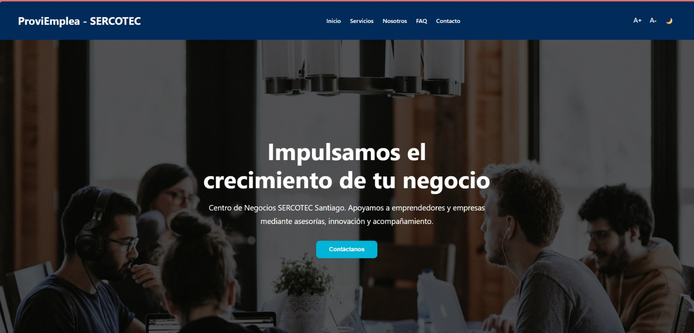

## Servicios

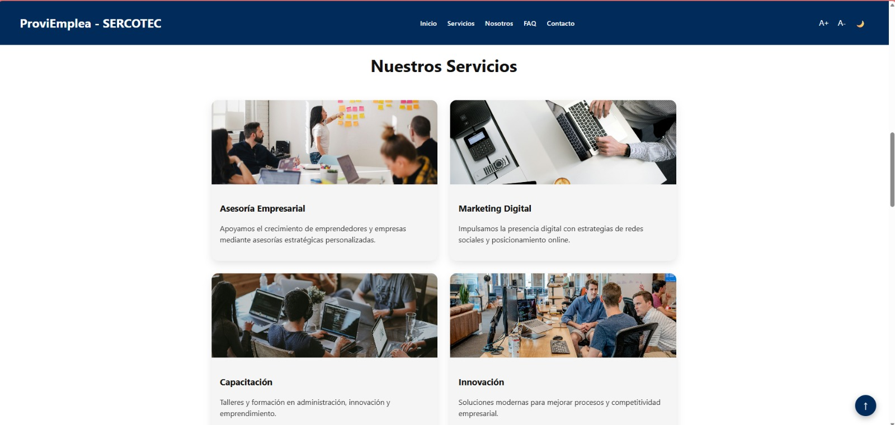

## Testimonios

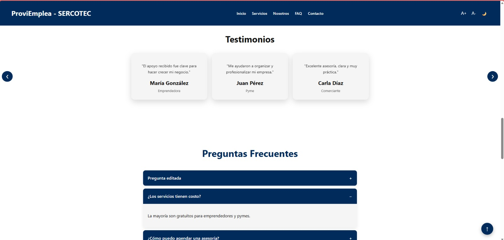

## FAQ dinámico

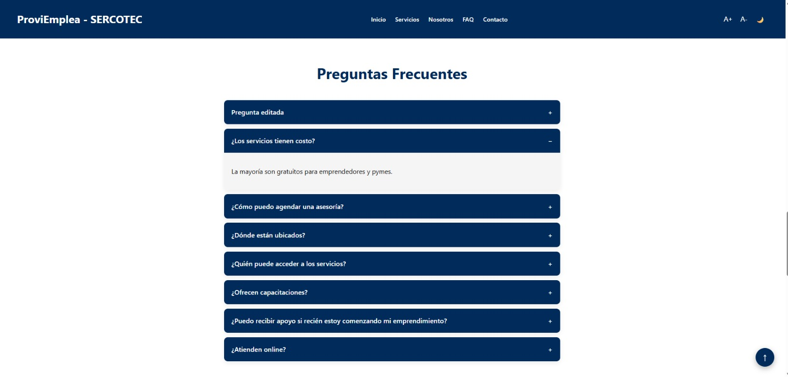

## Formulario de contacto

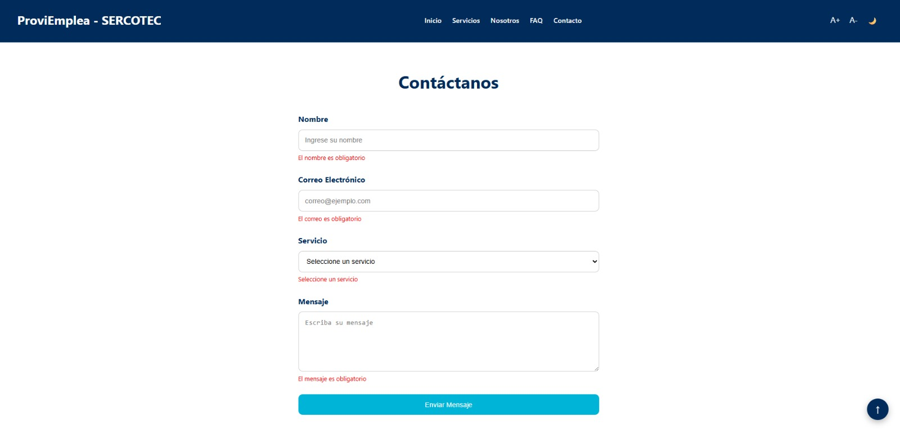

## Modo oscuro

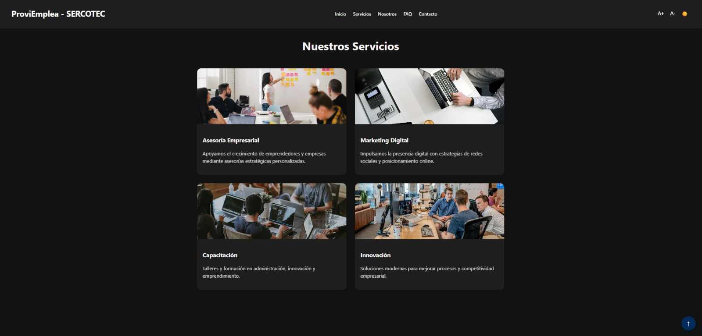

---

# JSON Server funcionando

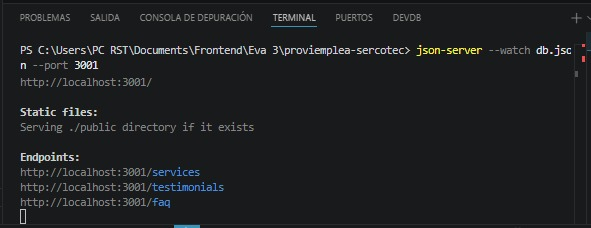

---

# Estructura db.json

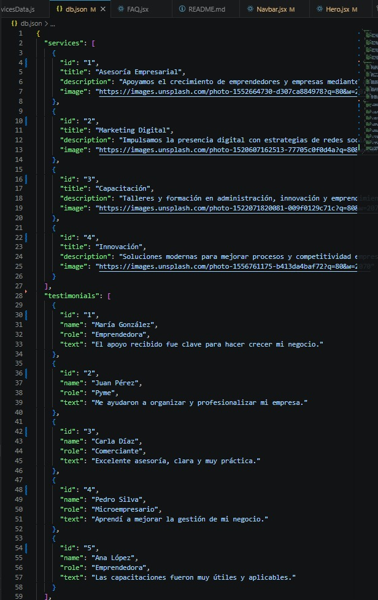

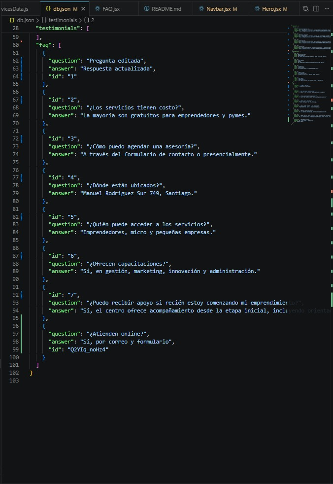

---

# Evidencias Postman

## GET FAQ

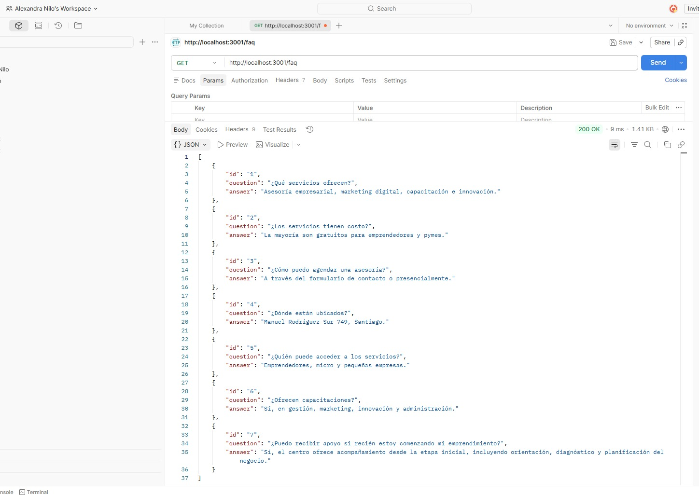

## GET Testimonials

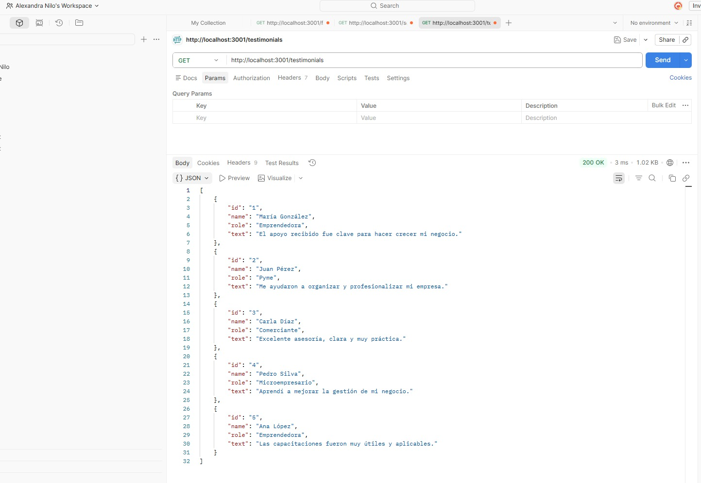

## POST FAQ

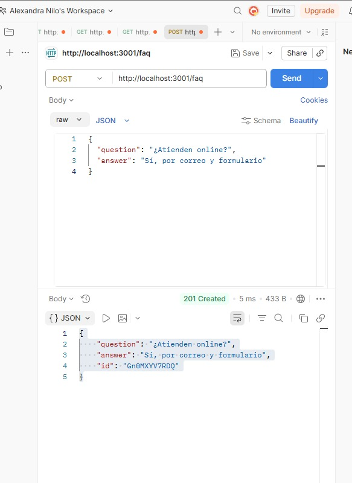

## PUT FAQ

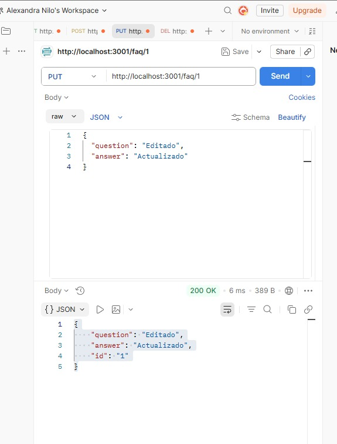

## DELETE FAQ

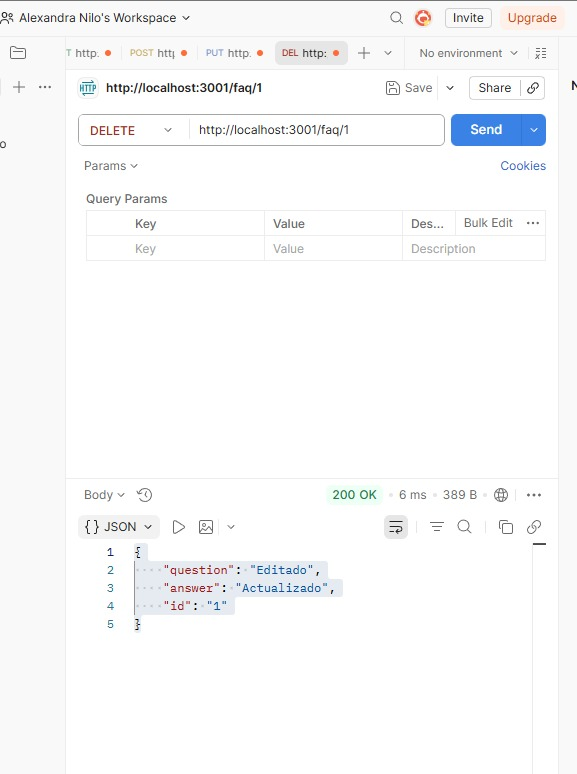

---

## Accesibilidad y experiencia de usuario

El proyecto incorpora:

- modo oscuro global
- ajuste de tamaño de fuente
- scroll suave
- navegación intuitiva
- diseño adaptable a distintos dispositivos

---

## Buenas prácticas implementadas

- Componentes reutilizables
- Organización modular
- Separación de lógica y estilos
- Uso de React Hooks
- Consumo de API mediante fetch()
- Código escalable y mantenible

---

## Video demostrativo

Demostración completa del funcionamiento del proyecto:

- navegación entre secciones
- modo oscuro
- FAQ dinámico
- consumo de API
- JSON Server
- formulario interactivo
- diseño responsive

https://www.youtube.com/shorts/dJHih6WUC7k

---

## Autor

Proyecto académico desarrollado para evaluación de Frontend utilizando React, Fetch API y JSON Server.

Desarrollado por Alexandra N.
